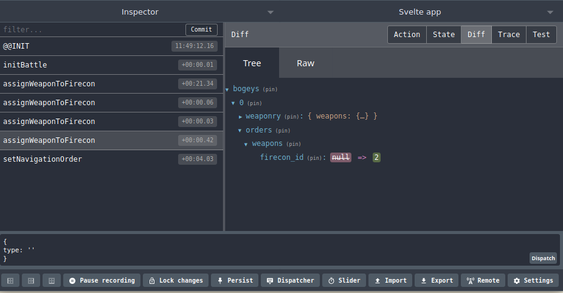

<div class="h-entry">
<div class="e-content">

<span style="display: none">#aotds, captain log 7:</span> The game state is now contained into a 
Updux store. It makes things
more structured and 
leverages the Redux browser devtools for sweet visualization of the state
and its changes.

<div style="width: 100%; text-align: center">

</div>

</div>
<a class="u-in-reply-to" href="https://twitter.com/yenzie/status/1352045552440143879"></a>
</div>

If you are curious, the binding of the [Updux](https://yanick.github.io/updux/#/) store to the svelte
reactive store and the enabling of [Redux
devtools](https://addons.mozilla.org/en-CA/firefox/addon/reduxdevtools/) goodness look like:

```js
import { writable } from "svelte/store";
import dux from "./battle/dux";
import { compose, applyMiddleware } from "redux";

const composeEnhancers =
  (typeof window !== "undefined" &&
    window.__REDUX_DEVTOOLS_EXTENSION_COMPOSE__) ||
  compose;

const duxStore = dux.createStore({}, (mw) =>
    composeEnhancers(applyMiddleware(mw))
);

const store = writable(duxStore.getState());

duxStore.subscribe(() => {
    store.set(duxStore.getState());
});

```

As for the `duxStore`, where all the logic will reside, it 
currently looks something like this:

```js
import Updux from "updux";
import u from "@yanick/updeep";
import { action as actionTS, payload } from "ts-action";
import { plot_movement } from "@aotds/aotds-battle";

const action = (name) => actionTS(name, payload());

const dux = new Updux({ initial: {} });

dux.addMutation(action("initBattle"), battle => () => battle);

dux.addMutation(
  action("setFireconTarget"),
  ({ bogey_id, firecon_id, target_id }) =>
    u({
      bogeys: u.mapWhen(
        { id: bogey_id },
        {
          weaponry: {
            firecons: u.mapWhen(
              { id: firecon_id },
              {
                target_id,
              }
            ),
          },
          orders: {
            firecons: u.mapWhenElse(
              { firecon_id },
              { target_id },
              { target_id, firecon_id }
            ),
          },
        }
      ),
    })
);

dux.addMutation(action("setNavigationOrder"), ({ bogey_id: id, order }) =>
  u({
    bogeys: u.mapWhen({ id }, (bogey) => {
      const course = plot_movement(
        u.updateIn("orders.navigation", order, bogey)
      );

      return u(
        {
          navigation: { course },
          orders: { navigation: course.orders },
        },
        bogey
      );
    }),
  })
);

dux.addMutation(
  action("assignWeaponToFirecon"),
  ({ bogey_id, firecon_id, weapon_id }) =>
    u({
      bogeys: u.mapWhen(
        { id: bogey_id },
        {
          weaponry: {
            weapons: u.mapWhen({ id: weapon_id }, { firecon_id }),
          },
          orders: {
            weapons: u.mapWhenElse(
              { weapon_id },
              { firecon_id },
              {
                weapon_id,
                firecon_id,
              }
            ),
          },
        }
      ),
    })
);

export default dux.asDux;
```

