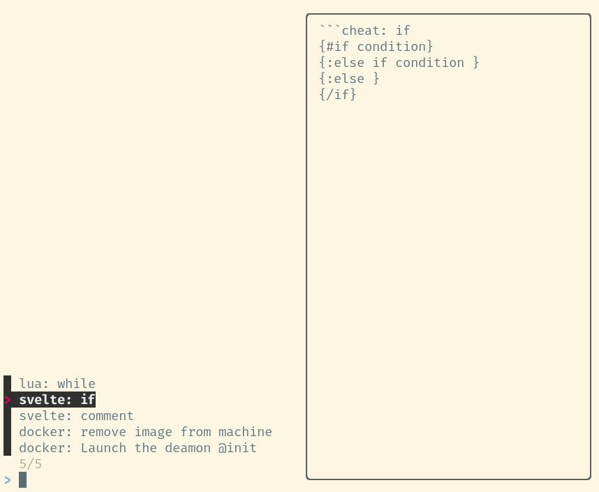

# Cheap cheat trick


Recently I came across a [glorious list of 
modern command-line tools][modern]. One of those tools is 
[cheat][cheat] a little system to save and retrieve little snippets of code
from the command-line.

My first reaction was "Neat!", because it is. Then I thought "wait, I already
have something like that. Kind of."

What I have is a private cheatsheet wiki, aka a directory full of Markdown
files. The fact that the Markdown files are free-form text is, for me,
preferable to the more restricted format of `cheat`, which is one
snippet per file. But I can see the allure of quickly finding a snippet via 
tags, and to access it via the command-line. Mostly for snippets pertaining
to command-line matters like docket commands, or tar recipes.

The question becomes... can I shoehorn the command-line behavior of `cheat`
to work with my Markdown wiki? Let's find out!

## Defining the markup of a cheat

First thing to do is to find a way to identify cheat items in 
the Markdown files.

Since those cheatsheets are usually copy'n'paste of commands 
I find and want to remember, they are typically terse:

```markdown
# Docker

# Misc commands

launch daemon:

    sudo dockerg -g /home/docker

list images:

    docker images

remove image from machine:

    docker image rm _image_id_

```

To keep it uncomplicated, why not use backtick-delimited 
code blocks, and add a label `cheat:` as part
of the opening backtick? I.e.:


```markdown
    # Docker

    # Misc commands

    ```cheat: launch daemon
    sudo dockerg -g /home/docker
    ```

    ```cheat: list images     @image
    docker images
    ```

    ```cheat: remove image from machine    @image
    docker image rm _image_id_
    ```
```

That ain't bad. It's still legible, has only marginally more markup,
and we can declare
that everything after the `cheat:` is the short description of that
snippet. As you see, I added optional `@tags` at the end of the description,
that's to help with searching down the line. 

And if that Markdown was being processed by something that highlights
code, we didn't rob ourselves of that. 
Having a first line looking like the following would (should?) totally work:

```markdown

    ```javascript cheat: invert keys/values of object
    inverted = Object.fromEntries( 
        Object.entries(original)
            .map(([k,v]) => [ v, k ]) 
    )
    ```
```

## Find those cheats

So we have cheats embedded in Markdown files. Great, now how to we
find them? With the might of `grep`, of course! Or, in this case, its 
younger relative, [rg][rg]:

```bash
$ rg '^```.*cheat:' $CHEATSHEETS_DIR --no-heading | cat

/home/yanick/vimwiki/cheatsheets/docker.md:``` cheat: Launch the deamon @init
/home/yanick/vimwiki/cheatsheets/docker.md:```cheat: remove image from machine
/home/yanick/vimwiki/cheatsheets/svelte.md:```cheat: comment
/home/yanick/vimwiki/cheatsheets/svelte.md:```cheat: if
```

Woo! We have them. But those lines are a little long. Let's cut the bits
that don't give us any valuable info:

```bash
⥼ rg '^```.*cheat:' $CHEATSHEETS_DIR --no-heading \\
    | perl -pe's#$ENV{CHEATSHEETS_DIR}##;'        \\
            -e's#```.*?cheat:##;s#\.md##' 

docker: Launch the deamon @init
docker: remove image from machine
svelte: comment
svelte: if
```

Yeah, that will do it.

## Select the cheat

Since our goal is to show a specific cheat, let's bring in
[fzf][] into the mix. And here's the magic: `fzf` allow to have custom
previews of the selected item, so let's be wild and have:

```bash
rg '^```.*cheat:' $CHEATSHEETS_DIR --no-heading \\
    | perl -pe's#$ENV{CHEATSHEETS_DIR}##;' \\
            -e's#```.*?cheat:##;s#\.md##' \\
    | fzf --preview="cheat-preview.pl {}" 
```

with `cheat-preview.pl` being:

```perl
my( $file, $text ) = split /:\s*/, shift, 2;

open my $fh, "<", $ENV{CHEATSHEETS_DIR}."/$file.md"
    or die $!;

my $line = 0;

while(<$fh>) {
    next unless /cheat:\s*\Q$text/.../```/;

    exit if /^```$/;

    print;
}
```

And that's give us



This is getting nice.

## Display the cheat

Once the cheat has been selected, all that is left to do
is to print it to the console. And since chances are we'll want to 
use it, why not copy it to the clipboard (minus the title) while
we are at it?

In the [Fish][fish] shell, assuming the cheat text is captured
in `$cheat`, that would look like:

```shell
set_color red; echo -e "\n" $cheat[1] "\n"; set_color normal;

set -l cheat ( string join '\n' $cheat[2..-1] )

echo -e $cheat

echo -e $cheat | xclip -selection clipboard
```

## Putting it all together

Assembling those parts together, we have the following `fish` script 
(also available
[here](https://github.com/yanick/dev-env/blob/main/roles/cheatsheets/files/cheat)):

```shell
#!/usr/bin/env fish

function cheat

    if test -z $CHEATSHEETS_DIR
        echo "CHEATSHEETS_DIR is not defined"
        return 1
    end

    set -l command $argv[1]

    if test "$command" = 'get'
        _cheat_get $argv[2..-1]
    else if test "$command" = 'list'
        _cheat_list
    else
        _cheat_query $argv
    end

end

function _cheat_list
    rg '^```.*cheat:' $CHEATSHEETS_DIR --no-heading \
        | perl -pe's#$ENV{CHEATSHEETS_DIR}##;' \
                -e's#```.*?cheat:##;s#\.md##'
end

function _cheat_query

    set -l query ""

    if test (count $argv) -gt 0
        set query ( string join " " $argv )
    end

    set -l selection ( \
        cheat list \
            | fzf --preview="cheat get {}" -q $query \
    )

    set -l cheat (cheat get $selection | string trim -c " \n")

    set_color red; echo -e "\n" $cheat[1] "\n"; set_color normal;

    set -l cheat ( string join '\n' $cheat[2..-1] )

    echo -e $cheat

    echo -e $cheat | xclip -selection clipboard

end

function _cheat_get

    perl -e '
my( $file, $text ) = split /:\s*/, shift, 2;

open my $fh, "<", $ENV{CHEATSHEETS_DIR}."/$file.md"
    or die $!;

my $line = 0;

while(<$fh>) {
    next unless /cheat:\s*\Q$text/.../```/;

    exit if /^```$/;

    print;
}
' $argv

end

cheat $argv
```

And using it looks like this:

<Asciinema src="/entry/cheap-cheat-trick/in-action.json" />


[modern]: https://github.com/ibraheemdev/modern-unix
[cheat]: https://github.com/cheat/cheat
[rg]: https://github.com/BurntSushi/ripgrep
[fzf]: https://github.com/junegunn/fzf
[fish]: https://fishshell.com/
