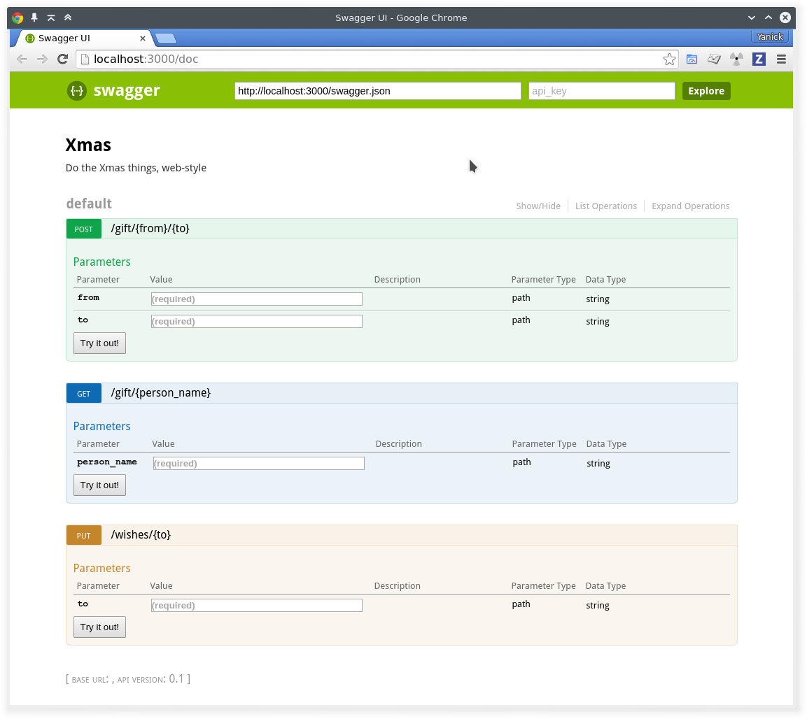
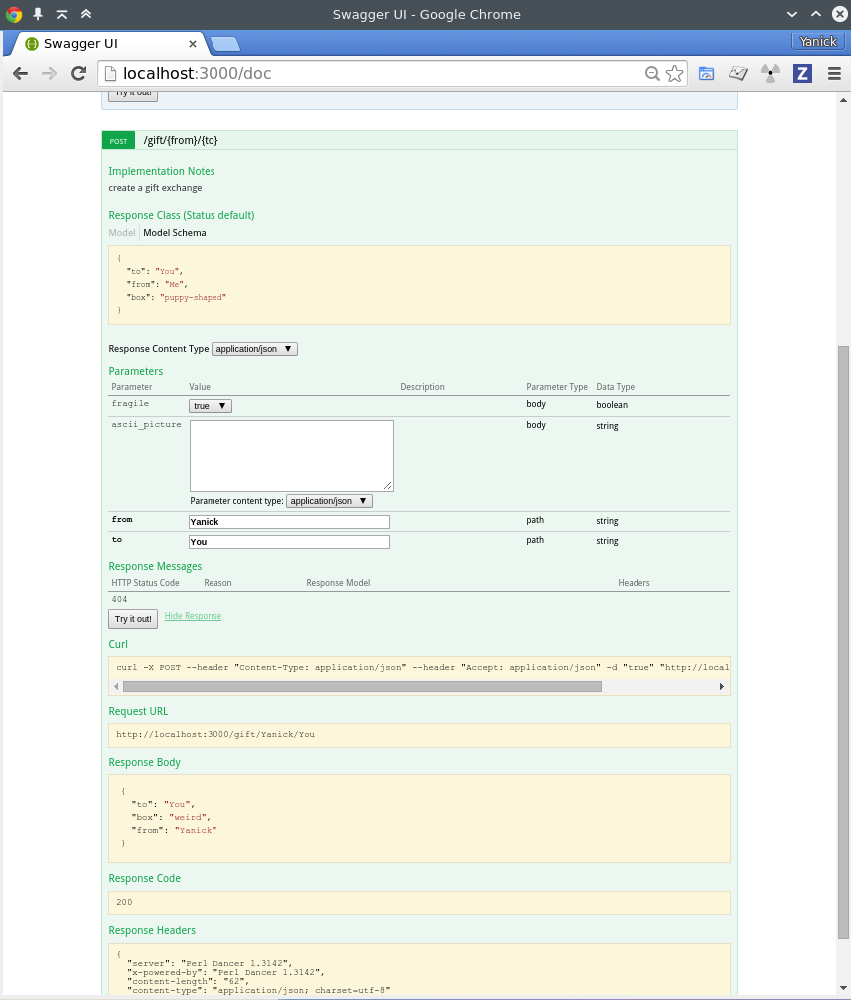

# Dance With Swagger

A REST API is as good as its documentation. But considering that documentation
is the proverbial boiled spinach sadly sitting on the very periphery of the
the dev's plate, it's no wonder that most of us are always on the lookout to
make its production more... palatable.

There are several solutions that help generating decent documentation from
the code itself. One that is doing the rounds  these days is
[Swagger](http://swagger.io). It has reasonable specs, its native formats are
the familiar JSON or YAML, and it comes with an ecosystem that already carry
an [online editor](http://swagger.io/swagger-editor/), 
a [HTML renderer](http://swagger.io/swagger-ui/), validators and other
goodies.

Writing the Swagger document for a REST API is not that hard, but if you do it
manually, there's a lot of duplication between the code and the doc itself.
And you know me and how lazy I am. That wouldn't do. So... say *hi!* to
[](cpan:Dancer-Plugin-Swagger).


## The Out-of-the-Box Experience

So, what does this plugin gives you. Well, imagine you have the following wee
Dancer app:

```perl
package Xmas;
# ABSTRACT: Do the Xmas things, web-style

use Dancer;

our $VERSION = '0.1';

get '/gift/:person_name' => sub { ... };

post '/gift/:from/:to' => sub { ... };

put '/wishes/:to' => sub { ... };

1;
```

We change `config.yml` to have `serializer: JSON`, and add two lines to the
app itself:

```perl
package Xmas;
# ABSTRACT: Do the Xmas things, web-style

use Dancer;

use Dancer::Plugin::Swagger;

our $VERSION = '0.1';

get '/gift/:person_name' => sub { ... };

post '/gift/:from/:to' => sub { ... };

put '/wishes/:to' => sub { ... };

swagger_auto_discover;

1;
```

And then, just like that:

```bash
$ curl http://localhost:3000/swagger.json
{
   "swagger" : "2.0",
   "info" : {
      "version" : "0.1",
      "description" : "Do the Xmas things, web-style",
      "title" : "Xmas"
   },
   "paths" : {
      "/gift/{from}/{to}" : {
         "post" : {
            "parameters" : [
               {
                  "name" : "from",
                  "in" : "path",
                  "type" : "string",
                  "required" : true
               },
               {
                  "required" : true,
                  "type" : "string",
                  "in" : "path",
                  "name" : "to"
               }
            ]
         }
      },
     "/gift/{person_name}" : {
         "get" : {
            "parameters" : [
               {
                  "required" : true,
                  "type" : "string",
                  "in" : "path",
                  "name" : "person_name"
               }
            ]
         }
      },
      "/wishes/{to}" : {
         "put" : {
            "parameters" : [
               {
                  "in" : "path",
                  "name" : "to",
                  "type" : "string",
                  "required" : true
               }
            ]
         }
      }
   }
```

Think that is nifty? Well, hold on to yours Christmas socks, 'cause if we go
and visit `http://localhost:3000/doc` instead:



The plugin gathered all our routes, figured out their route parameters, got
the name of the app, its description, its version, and yes, the `try it out`
buttons work.

Yes. What you are hearing *are* angels singing. You're welcome.

## More goodies

The module is still very young, but it already have quite a few goodies
includes. The UI can be toggled on and off, the url locations are
configurable. You can already tell the auto-discovery mechanism to skip some
routes. And documentation that can't be figured out from the route itself is
given by prefixing any route with `swagger_path ...'. Like so:

```perl
swagger_path {
    description => 'create a gift exchange',
    parameters => [
        { name => 'fragile',       in => 'body', type => 'boolean' },
        { name => 'ascii_picture', in => 'body', type => 'string' },
    ],
    responses => {
        default => { 
            description => "gift has been recorded",
            example => { from => 'Me', to => 'You', box => 'puppy-shaped' },
            schema => { '$id' => '#/definitions/gift_response' },
        },
        404 => { template => sub {
            +{ error => "giftee or gifter '$_[0]' not found" } } 
        },
    },
},
post '/gift/:from/:to' => sub { ... };
```

Yes, it's a little verbose. For the moment, it follows pretty closely the
Swagger specs, but I expect that in future releases I'm going to inject some
DWIMery in there. 

Not that there isn't already some DWIMery present. That `example`, up there?
It'll be converted to the right format, JSON or YAML, in the docs for you.
Oh, and that `template`? It's to go with the plugin keyword
`swagger_template`, so that you can do:

```perl
post '/gift/:from/:to' => sub { 
    ...;

    return swagger_template 404 => $missing_person
        if $missing_person

    ...;
};
```

It's not a huge thing, but it'll do wonders to ensure that the route responses
are consistent. Even moreso once I merge support for JSON Schema validation
(yes, there was a reason why I did [](cpan:JSON-Schema-AsType)). And for that,
the `swagger_definition` keyword is already present:

```perl
swagger_definition gift_response => {
    type => 'object', required => [qw/ from to /] 
};
```

So, yeah, lots of stuff to improve on, but already, look at what this code is
already adding to our UI:



Isn't **GLORIOUS**?


