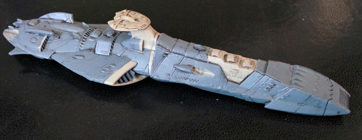
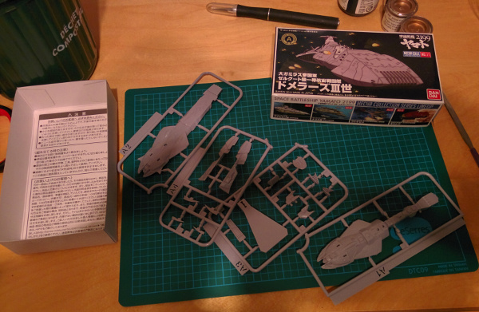
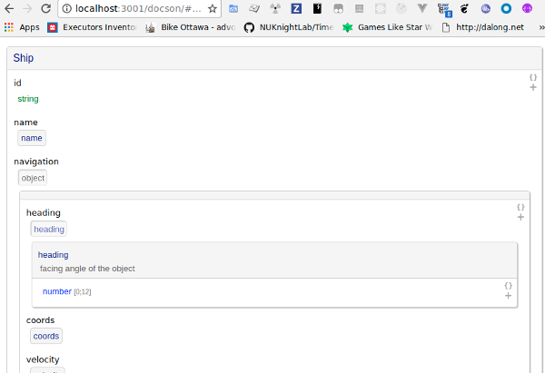
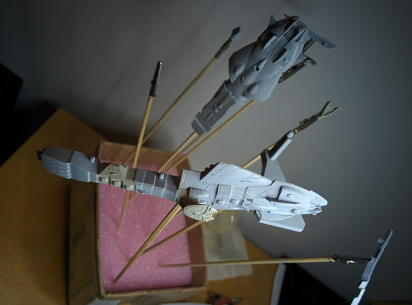
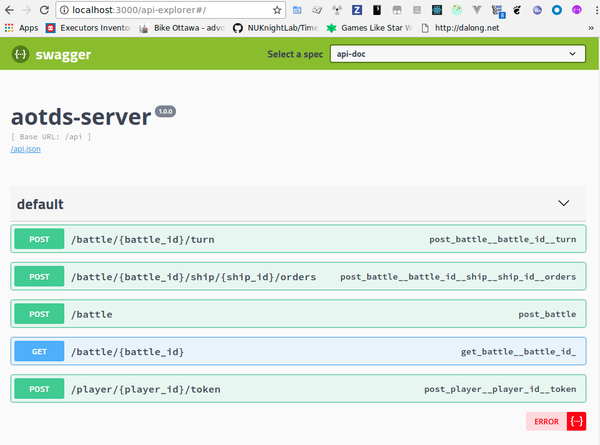
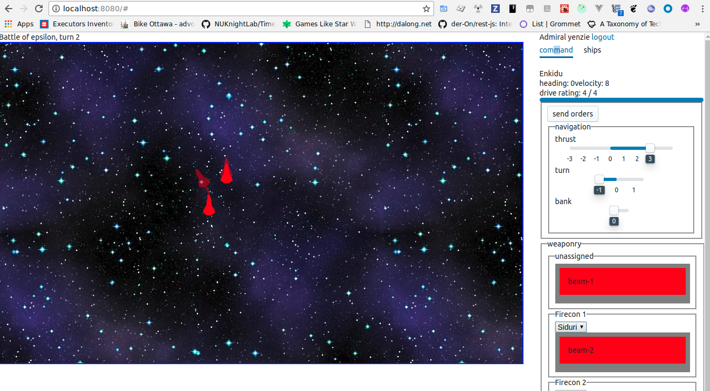

# JavaScript of the Darkest Sea

<div style="text-align: center;">

<div style="font-size: small">The <i>M</i> part of this MVC app was taken very literally</div>
</div>

For many years now, mentions of a mythical spaceship game were sighted in 
many of my blog entries. Like the tantalizing, terrifying glimpses of a
monstrous fin breaching the turmoiled flotsam of a chaotic ocean surface, 
they hinted at the slow, ponderous movements of a leviathan evolving
just beyond our realm of perception.

Well, reach out for your coveralls and Sou'westers, fellow sailors, for this
beast is about to leap into view. This blog entry is all about
a high-level
walkthrough of the technologies I sampled for that epic project -- sharing my
impressions and findings, likes and dislikes in the hope they'll help  other
people navigate this sometimes exalting, oft befuddling place that is 
the SargaJSo sea. And who knows? Perhaps it'll somehow tempt 
some hapless souls into joining the fun.

## Before the darkest time

To truly understand this project, we have to jump back 
to the early days of of my young tender teenage years (yup, it's
going to be *that* kind of blog entry. You prolly better to go and pour yourself
a beer or get a glass of wine, you gonna need it) 
when a dear friend and homonym introduced me to the 
world of Battletech. For those who don't know, Battletech is a tabletop
game where giant robots wage war and laser/missile/fisticuff the steel-clad hell out of
each others. It's a lot of fun, and many dice-fueled, machine oil-dripping,
metal-screeching sessions ensued.

Fast-forward to modern time. These days, I don't have that much time to play,
but when I do, I'm still awfully fond of computer turn-based, campaign-oriented
types of game.  Computer games mostly because the number of local friends I
have has dwindled throughout the decades. Turn-based because, frankly, I'm not
a quick thinker nor I have any type of recommendable reflexes; all my
attempts at ANY form of RTS or FPS games ended up with quick and numerous
deaths -- all pitiful, all mine. And campaign-based because I'm a storyteller at heart, and
there is nothign that lend itself more to dramatic narrative than the rise and fall of warring
factions. 

In the series of games I've  played to 
satisfy my belligerent cravings, honorable mentions  go
to the X-COM-inspired [UFO: Alien Invasion][UFO]. 
And then there is [Megamek][], a java-based port of the original Battletech.
This one 
has a good community, and a few campaign servers where you  pit your war machines against fellow
gamers. It's a good port, but not 
without flaws. The interface is not the snazziest (although, to be
honest, I don't really care about that), but more devastating is the
glacier-like speed of games. We're talking many hours of crawling stop-and-go
for even smallish games here. And while it is,
in theory, possible to run local campaign servers where a small group of
friends could coordinate their gaming time, it's a process I never managed 
to go through (as mentioned, everything is Java-based, and the documentation
is on the scarce side).

So one night, after I tried to set up one of those campaign servers and
failed, I did what I'm wont to do. To wit: I bellowed to the
uncaring night "Fine! I'll write my own game! And it'll have campaigns! And
it will be AWESOME!"

Yet another port of Battletech was, without surprise, one of the first
considerations. But this is a game with many intricacies, and my delusions of
gamedeur weren't potent enough to totally disassociate me from the realms of
what's possible.
Perhaps it'd be wise to begin with something with a... more modest set of
rules?

In fact, why not a space fleets game? That would take care of the headaches of
terrains, obstacles and
line-of-sights. The universe of Battletech *does* had spaceship extensions, but they
are a tad meh. I thought about Star Fleet Battles, but if I wanted simpler
rules, that'd be going in the wrong direction.
And then I found Full Thrust. Officially a miniature game (&agrave; la Warhammer 4K), 
it has a set of rules that are simple enough not to require a
PhDnD to master, yet complex enough to make the wee bean-counter in me squee with
glee.

And just like that, I had found a Grail to quest toward.
I even promptly managed to go over the most difficult part of this (nay, of
any) project. Namely, come out with a cool codename for it:

<div style="font-size: xx-large; font-weight: bold; text-align: center">Armadas of the Darkest Sea</div>

Overly dramatic, portentous, bearing the
promise of fiery battles smelling faintly of rum. It was perfect.

And then I found out about the 
miniature X-Wing
game (which seems to be fun, but alas coming with a pricetag as astronomical
as its promised dogfights). And then I found out about the variant it spanned
dealing with capital ships. And then I checked out and found that 
it was called Armad<b>SON OF A BUTTERFLY--</b>

So yeah, as I was saying, I came out with a codename for it:


<div style="font-size: xx-large; font-weight: bold; text-align: center">
<strike>Armadas</strike> Fleets of the Darkest Sea</div>

Still cool.


Throughout the following years that pet project 
was used as the fun end to equally fun yet more practical means of trying out
technologies. More [Dancer][] modules I dare to admit were created as potential
pieces for it. Then sometime last year I decided it would
be the perfect test subject for all those new-fangled JavaScript things.

So I dove into all those new-fangled JavaScript things.

And I really mean

All. 

Of. 

Them.

I almost went mad. Probably went mad. Okay, fine, *madder*. Point is, I 
drank from the fire-hose until my water retention came within
spitting distance of the arctic icesheet. Lately, things finally began to
stackbilize enough and, hey, what would you know I had something somewhat showable. 
Not yet playable, hardly pretty yet, but showable. So show it I had to. 

And just like that we can conclude this overstuffed recap session, and get
into the meat of the matter.

And how meaty that matter is.  The project is so epic, that it had to
be conceived as a tech turducken: a [game engine](https://github.com/yanick/fotds-battle) orchestrated by a 
[RESTish server](https://github.com/yanick/fotds-server), itself fronted by a [web application](https://github.com/yanick/fotds-app). Each layer having its
different accents and libraries.
In the following sections, we'll visit them one by one.

Oh, before we do, a quick sidenote: a new [Battletech][] game made by the original crew just
happen to come out of beta a few days ago.
I'll definitively have a look at it. I must say, though,
that I'm a little scared by the requirements -- my computer tends to be on the
wimpy side, considering my cli-jokey tendencies. And... I mean, 30gb of free disk
space? That's... that's almost, like, *twice* the size the JavaScript libraries I've
used on this
project (I kid, I kid! I... perhaps wish I was kidding more, though...).


## [The Heart of Darkest](https://github.com/yanick/fotds-battle)

<div style="float: right; width: 300px; padding-top: 10px;">

<div style="font-size: small; text-align: center">
Content of <code>package.json</code>, an
artist rendering
</div>
</div>


At the very core of the whole thing lies the implementation of the game logic.
Very early, I latched on [Redux][] to be system's armature. Indeed, Redux (and
the whole slew of similar store framework) is just perfect to drive the very
programmatic-friendly rules of that type of game. You have actions
representing the, uh, things that happen (ships moving, weapons firing, etc), 
middleware pieces that orchestrate the reactions to those things (the ships
are moving where, the weapon fires are dealing what kind of damage), and
a dirt-simple data structure that
represent the state of the game. 
Both actions and state are all JSON objects,
so easy to read and follow, and the middleware bits are modular and lend
themselves well be tested individually or as a whole. To give you an idea, the
main middleware watching for the
action triggering a new turn looks like


```javascript
const play_turn = mw_for( Actions.PLAY_TURN, 
    ({getState, dispatch}) => next => action => {

    // don't play turn if some players didn't play their
    // turn yet
    if ( !action.force && (
            players_not_done(getState()).length > 0 
            || active_players(getState()).length <= 1 ) ) {
        return;
    }

    next(action);

    dispatch(Actions.move_objects());
    dispatch(Actions.assign_weapons_to_firecons());
    dispatch(Actions.execute_firecon_orders());
    dispatch(Actions.fire_weapons());
    dispatch(Actions.clear_orders());
});
```

in turn, the action to move all objects is later on forked into
per-object actions down the line via

```javascript

const objects_movement_phase = mw_for( Actions.MOVE_OBJECTS, 
    ({ getState, dispatch }) => next => action => {
        next(action);

        _.get( getState(), 'objects', [] )
            .filter( o => o.navigation )
            .map( o => o.id ).forEach( id => 
                dispatch( Actions.move_object(id) )
            );
});
```

and each object movement is then dealt with via

```javascript

const object_movement_phase = mw_for( Actions.MOVE_OBJECT, 
    ({getState, dispatch}) => next => action => {
        let object = get_object_by_id( getState(), action.object_id );

        next(u({
            navigation: 
                plot_movement( object, _.get( object, 'orders.navigation' ) )
        })(action))
});
```

The main idea being to keep each piece involved small and targeted. Which was
pleasantly less hard to do than expected, thanks to the help of 
[lodash][] (and its functional programming [variant][lodash/fp]) and
[updeep][].

### War Sagas

Originally, the battle middlewares were to be driven by [sagas][], as
they are easy to test and, well, 'sagas' just sound so damn epic.
Unfortunately,
I discovered that there is one fairly significant rift between how I want to
do things, and how Sagas allow you to do them.

You see, the way I have my chain of middlewares set up, I have situations
where some upstream 
middleware issue a high-level action (say, triggering the movement phase of a
ship), and downstream middlewares flesh out the details before they are fed
to the reducer. 


!(mermaid:mw1.mmd)

(that's what is happening in that weird `next(u(...))` stanza in the 
`object_movement_phase` middleware of the previous section.

The problem is that with sagas, actions cannot be altered nor blocked: by the
time you see them, they already made their way to the reducer.

Not that it's an unsolvable problem, mind you. A straight-forward although
questionably 
palatable solution would be to have the middleware issue a second
`MOVE_SHIP` action, and have the reducer ignore any `MOVE_SHIP` actions that
don't have all its trimmings.

!(mermaid:mw2.mmd)

A better approach would be to lay off the overloading sauce and 
define two actions for the two steps that are implicit in `MOVE_SHIP`.

!(mermaid:mw3.mmd)

In all honesty, I think sagas have it right and I have it wrong there. The
fleshing out actions by middlewares as I'm doing it is clever, but not
necessarely good clever. Having multiple actions is more verbose,
but would let the actions have stricter, more specific schemas (`COMPUTE_MOVE_SHIP` only has
the ship id, `MOVE_SHIP` *must* have `coords`). So what I'm saying is... I am
still on the fence on this one, and might revisit sagas in a not-so-distant
future. Happily enough, for Redux middlewares are middlewares, so when the
pendulum does swing, the basic 
middlewares I'm currently using could easily be uplifted piecemeal as sagas.

### Dialects sea

That the project was going to be JavaScript-based was firmly nailed in. But
JavaScript covers a vast array of dialects. Considering my thirst for
futurism, it was evident that I'd at least [Babel][] my way to the latest and
greatest. 

To enforce types and a sound structure, should I lean into 
[Flow][] or [TypeScript][]? I tried both. And while they each had their
appeal,
the endless compatibility dances I had to perform to get all the shinies 
I wanted to see in the project work well together
made me decide to stick with "vanilla" JavaScript. 

Still, JSON objects are
incredibly flexible, and I'm terrible at keeping track of the data structures 
I come with; I needed some structural backbone to lean to. Something to 
document (and potentially validate) all those bits of data. 
For both, I reached out for [JSON schema][]. Hilariously enough, I went to look
out for a nice tool to generate documentation out of those JSON
schemas, and somehow ended up joining the core crew of [docson][]. Go figure.




### Darkjest sea

For testing, I was dead-set on using one of the JavaScript [TAP][] testing
libraries. Partly because of my familiarity with TAP, partly because I like
the concept of the test files being just normal JavaScript scripts, and not
needing to be run by a special testrunner. And also because of a personal
distate for the discomfortably awkward English that most popular libraries foster 
(looking at you `expect().to.be.match()` and `it( 'puts the lotion' )`). 

Eventually, though, I did give [Jest][] a chance, and was agreeably surprised.
Jest provides out of the box expectation and mocking functions that don't
suck, and strike a nice balance between being
helpful and not overdoing it. So to Jest I went.

### Debugest sea

Logging. Oh lord. Such a simple thing, and I wasted oh so many hours trying to 
find the perfect solution what would work in both the browser and in Node. I
tried [Bunyan][], and the first thing that came to mind was "oooh, so much
information", and then came the "aaaaaaah, too noisy, too noisy!". And so many
others... at the end settled for zen-like simplicity in the shape of [debug][]. So far it
works well for me, and when the time come to have more regimented logs, I
might step up to [pino-debug][]. 

## [DarkREST sea](https://github.com/yanick/fotds-server)

<div style="float: right; width: 300px; padding-top: 10px; margin-left: 0.75em">

<div style="font-size: small; text-align: center">
Kebab-case? Yeah, it has its uses.
</div>
</div>

The
next step was to open the communication gates with  the game engine.
Eventually (and by that, I mean in the next section), we'll
want a spiffy UI with purty things that go *zoom* and *pew* *pew*, but as a
foundation,
we want a RESTish server that works for both people and machine. Mind you, I
mostly mean "RESTful", there.
I just use an even looser term to give myself the leeway
to be lax in my following the REST and RESTful percepts, and thus preemptively
defusing any potential outrage from the nomenclature police.

So, for that RESTish interface, I went with [Koa][]. In fairness I could have 
just as well went
for [Express][], but I wanted to ride the bleeding edge train all the
hemoglobous way. 

Notice that I said that the interface had to be usable by humans as well. 
To do that, and to go on on my resolution to have order, I ensured that the 
the RESTish service would be driven by Swagger/[OpenAPI][] specs. 
Happily enough, schemas in OpenAPI are a subset of JSON
schema specs, so the schemas already defined for the game engine could be
reused as needed. Win. And thanks to some judicious Koa plugins, it's a breeze
to have those specs displayed and made interactive as part of the service.



### Fleets of da taba se(a)

For this applications, the initial requirements for the database were simple. 
Games have turns. Turns are Redux JSON data structures. We need to stash the
turns somewhere. Nothing fancy, a document store, really, would suffice.
So at first had my eyes on [PouchDB][]. But at some point I decided that
my needs were so basic 
that using a classical database 
via [Objection][] and its JSON type was more than enough to get me going.


### Auth of the darkest sea

For the authentication system, still vastly protozoic, I opted for 
[JSON Web Tokens][], mostly because 
[Genehack convinced me they are a good thing][genehack].

### Darkwebst sockets

And finally, while chatting HTTP back and forth with the RESTish service 
is perfectly fine for most things, I also wanted direct communication with the players
when a new turn would be available. So [Websockets][] was also thrown 
into the mix.


## [App of the darkest sea](https://github.com/yanick/fotds-app)

<div style="float: right; width: 300px; padding-top: 10px;">

<div style="font-size: small; text-align: center">
Hey! Slap a coat of paint on it and it'd begin to look half-way decent!
</div>
</div>

Playing a game solely via a RESTish interface would be spartan, 
and that won't do. No, this project also needed a cool web front-end. 

### DarkJSX sea

Again, this is a part of the project where I tried aaaaall the things. 
For quite a long time, I was set on [Vue][]. As far as I can tell, my final two main
contenders, Vue and [React][], are very close in term of ease of development,
but the line between HTML and JavaScript were, to me, more distinct and easier
to grok with Vue. 

But using Vue and Redux felt a 
little bastardized, so for the state of the app I gave a go
to Vue's own [VueX][]. 

Using a different store system than the game engine, 
with all the slightly different things it involve, didn't bother me too
much.  At the end, it's the reactive nature of VueX that turned me off that
solution. Whereas Redux is all about functional programming and lack of
side-effects, the reactive nature of VueX makes it entirely about
side-effects. When it works, it's magic, but when it doesn't, the debugging
can be quite a pain. So back to Redux I went. And, then, back to React as
well. Perhaps because those two work very well together, perhaps because
the development tools available in Chrome and Firefox for
them both are truly a joy to work with.

The switch also had some consequences for the building process of the app.
With Vue I was leveraging [Poi][], which deal with all the bothers of Babel and Webpack
configurations for us. Once back to React, it also meant back to raw
[Webpack][]. Which, oh well, is not so bad.


### Darktest sea

Of course, I'm still testing and  using Jest when I can. For the prototyping of the 
React components, however, I also dragged in [Storybook][], which is superb
in the way it allows to play with pieces of the interface individually,
instead of having to juggle with the whole application every time one wants to
tinker on an itsy-bitsy detail.


### Flotsam and driftwood

For styling, I had to go with [postcss][]  (had to keep the bleeding theme
intact, you understand). For pre-made components, I picked [Blueprint][].

For the visualization of the battle map and ships, it *had* to be SVG.
Indeed, I think SVG was the very first technology I had earmarked to play with
on this project.
That was when
then there was the tantalizing promises of easy animations
via SMIL. And that kind of petered out. And then JavaScript libraries and
CSS animations came along, and gave it a revival of sort. 

### Fleets of the-- ah heck, let's look at the damn thing already

What does the app looks like currently? It looks like this:

<div> </div>

Granted, it's not pretty yet. But... but we have a battle map that can
be panned and moved around. We have a command panel for our ships. We can 
see the course of the ships change as we play with thrust and turns and
banking. We can assign weapons to stations by *dragging* them. We can 
select targets by, uh, selecting them in a drop-down. It's not done yet, but
it's so close to playability I can almost smell it. 


[Koa]:             http://koajs.com/
[Express]:         https://expressjs.com/
[postcss]:         http://postcss.org/
[UFO]:             https://ufoai.org/
[Babel]:           https://babeljs.io/
[Battletech]:      http://battletechgame.com/
[Dancer]:          https://metacpan.org/releases/Dancer2
[Flow]:            bhttps://flow.org/
[JSON Web Tokens]: https://jwt.io/
[JSON schema]:     http://json-schema.org/
[Megamek]:         https://www.megamek.org/
[Objection]:       https://vincit.github.io/objection.js/
[React]:           https://reactjs.org/
[Redux]:           https://redux.js.org/
[Sagas]:           https://redux-saga.js.org/
[TypeScript]:      https://www.typescriptlang.org/
[Vue]:             https://vuejs.org
[VueX]:            https://vuex.vuejs.org
[Websockets]:      https://developer.mozilla.org/en-US/docs/Web/API/WebSocket
[genehack]:        https://www.slideshare.net/genehackdotorg/jwt-jwt-let-it-all-out
[Jest]:            https://facebook.github.io/jest/
[TAP]:             https://www.node-tap.org/
[docson]:          https://github.com/lbovet/docson
[Blueprint]:       http://blueprintjs.com
[Bunyan]:          https://github.com/trentm/node-bunyan
[OpenAPI]:         https://www.openapis.org/
[Poi]:             https://poi.js.org/
[PouchDB]:         https://pouchdb.com/
[Storybook]:       https://storybook.js.org/
[Webpack]:         https://webpack.js.org/
[debug]:           https://github.com/visionmedia/debug
[lodash]:          https://lodash.com/
[lodash/fp]:       https://github.com/lodash/lodash/wiki/FP-Guide
[pino-debug]:      https://github.com/pinojs/pino-debug
[sagas]:           https://github.com/redux-saga/redux-saga
[updeep]:          https://github.com/substantial/updeep
