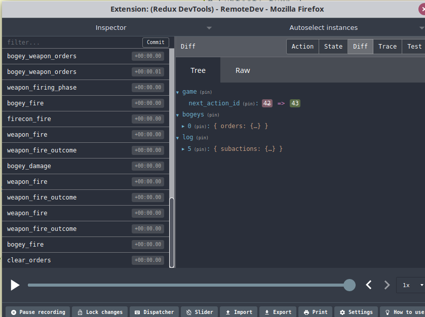
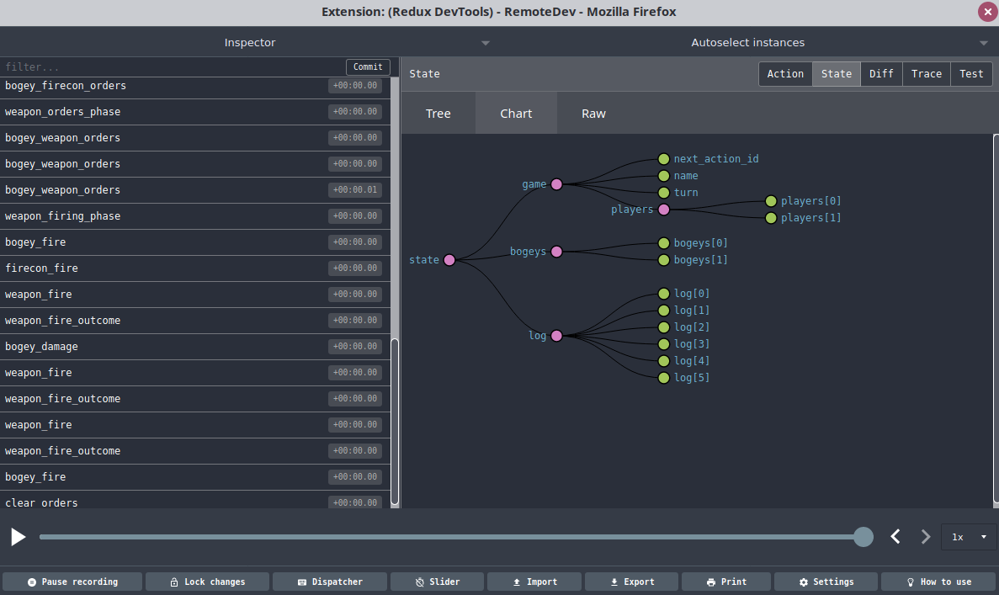
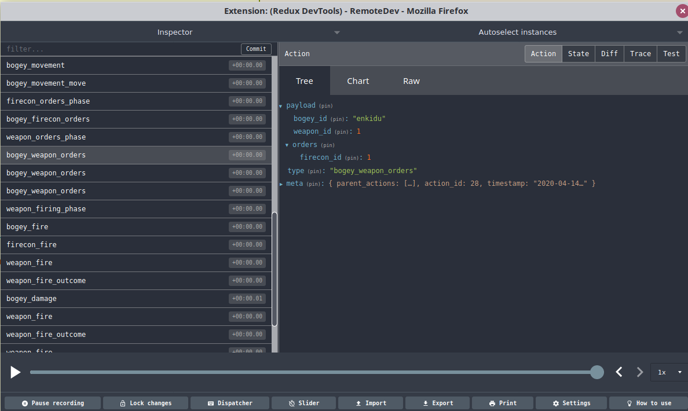
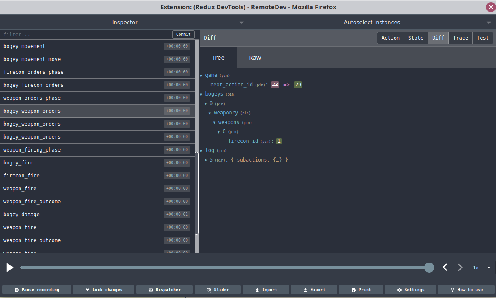
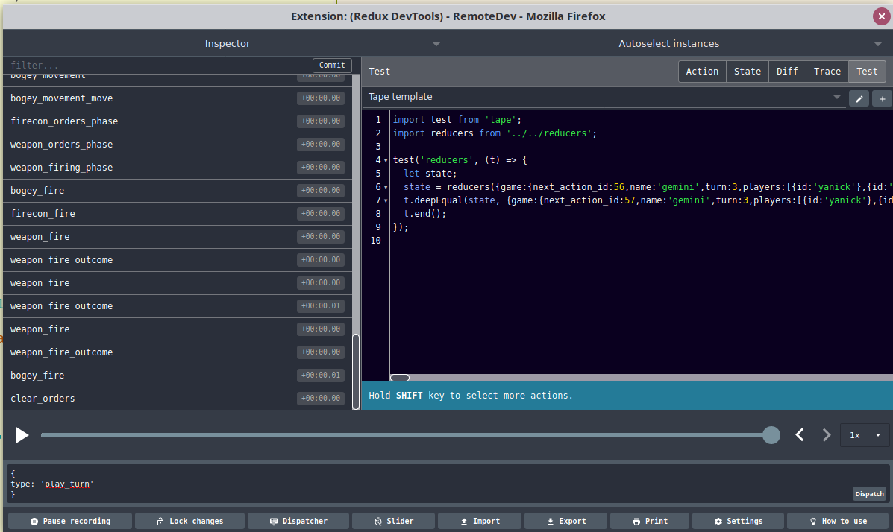
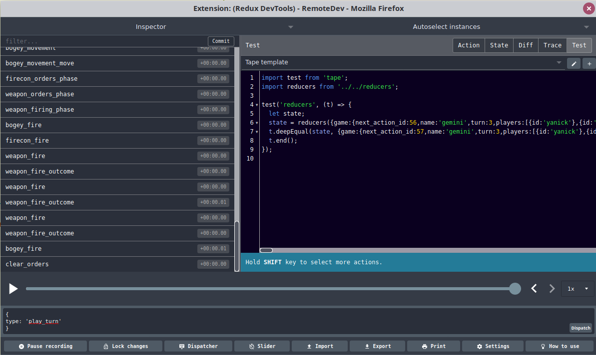

# A REPL through time

When bugs strike,
a developer's traditional first investigation weapon is a liberal
dissemination of debug statements. Crude, but usually effective.

When things get more involved, we typically escalate to the
debugging/REPL tools we have at our disposal. With that we can freeze
the program in time and peek at variables and stack calls. And just like in
all those movies where somebody has time-controlling abilities, we can alter an
argument here, call an unexpected function there, and generally bask in
god-like powers.

Redux-powered programs push that to the next level. With the right
dev tools, we can not only freeze the wheel of time, but also make it spin
backward. Forget about solving mysteries; ours is the power to rewind history
until we can witness the original events themselves.

But let me show you.

## The dependencies

First, we need a few things.

On the JavaScript side, we need
[remote-redux-devtools](https://www.npmjs.com/package/remote-redux-devtools) and
[remotedev-server](https://www.npmjs.com/package/remotedev-server):

```js
$ pnpm add remote-redux-devtools remotedev-server
```

`remote-redux-devtools` is the middleware that is doing to
make the Redux store and its history available to the outside
world. `remotedev-server` is a server that is going to
be the central hub between the observed program and the
debugging UI.

But what is the debugging UI? It's
the main
[Chrome](https://chrome.google.com/webstore/detail/redux-devtools/lmhkpmbekcpmknklioeibfkpmmfibljd?hl=en)
or [Firefox](https://addons.mozilla.org/en-CA/firefox/addon/reduxdevtools/) Redux devtool, which will be
able to visualize the store just like it does for web-based
ones.

## Intrumenting the code

Modifying the Redux store to be hookable is pleasantly
straightforward:

```js
import { applyMiddleware, compose } from 'redux';
import {composeWithDevTools} from 'remote-redux-devtools';

const composeEnhancers = composeWithDevTools({
    realtime: true,
    port: 8000,
    maxAge: 3000,
    actionsBlacklist: [ 'inc_action_id' ]
});

const battle = Battle.createStore(undefined, middleware => {
    if(process.env.REDUX_DEBUG)
        return composeEnhancers(applyMiddleware(middleware));

    return applyMiddleware(middleware);
});
```

Mind you, the `createStore` there is from an Updux object. The pure
Redux version would look like:

```js
const battle = createStore(
    reducer,
    composeEnhancers(applyMiddleware(middleware))
);
```

If the application runs continuously, we are done! If not,
we have to put the breaks somewhere such that the program
doesn't terminate before we have time to reach out to the devtool.
That can be done by dropping the following code near the end
of the program:

```js
console.log("ready to debug");

await new Promise( resolve => setTimeout(resolve,1000000));
```

And with that, we're loaded for bears.

## Unleash the magic

Time for awe. First, we launch the `remotedev` server:

```js
$ remotedev
```

Then the program under test:

```js
$ node src/testme.js
```

And then we open the browser Redux tool, select `Open remote devtools`,
aaaaand BEHOLD!



There are quite a few things we can do with that tool. We can inspect
the state of the store as it is now, of course:



We can look at all the actions that got dispatched to the store:




We can also look at how each action did change the state of the store:




And when we're tire to look at the past, we can also dispatch new ad-hoc
actions (and see their effect on the state, natch):




Cherry on the sundae: the UI will even provide with boilerplate tests
based on the actions and state of the store:



Now, c'mon, tell me this ain't nifty as all hecks!


