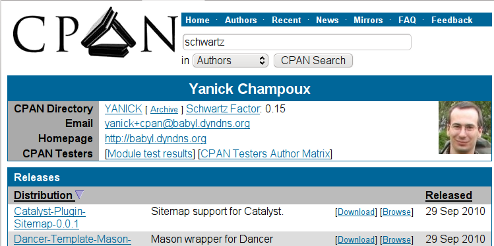

# Your Schwartz Factor on your CPAN Page

The [Schwartz factor](http://use.perl.org/~brian_d_foy/journal/8314) of a CPAN
author is the ratio of the number distributions of that author over
the number of tarballs sitting in his CPAN directory.
A low number indicates that it's probably
time for this author to do some clean-up (without fearing to lose the old
tarballs, as they will always be available via the
[BackPAN](http://backpan.perl.org), natch). 

As such, I wanted to include a periodic check of my Schwartz factor to my 
[monitoring system](http://babyl.dyndns.org/techblog/entry/system-monitoring-on-the-cheap).
Coming up with a script to extract the information from my CPAN home directory
was simple enough:

`` schwartz_factor.pl ``

This is not exactly the most robust code I ever written -- the parsing of the
page should be left to [HTML::Tree](cpan), really -- 
but it's doing what it's supposed to do. Not, though, that depending on which mirror site 
you'll hit, the factor may vary a little bit.

But then I thought, why keep the fun offline? So I imported the logic into
a GreaseMonkey script and I now have the Schwartz factor of CPAN authors added
to their CPAN pages:

<label>the Schwartz is weak with this one</label>

The script will not work for authors who dropped an *index.html* in their
home directory, or if they use sub-directories, but I expect that they should
be more the exception than the rule.

The GreaseMonkey script is available on the 
[userscripts.org](http://userscripts.org/scripts/show/90454) site,
and on [GitHub](https://github.com/yanick/greaseyanick).

