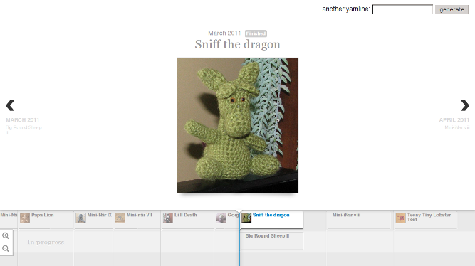

A while ago, I spotted [TimelineJS](http://timeline.verite.co/), a JavaScript
library to create gorgeous timelines, and earmarked it to a future app.  Last
week, I finally get to play with it by creating
*Yarnline*, an itsy-bitsy mashup app that
takes the projects of a [Ravelry](http://ravelry.com) user and display them
in a chronological manner, like so:

The app is running on my home [server](http://yarnline.babyl.ca) (but requires you to
have a Ravelry account).  The [code
itself](https://github.com/yanick/yarnline) is, for once, fairly banal. It's
using <cpan>Dancer</cpan> (and its beautiful, no-fuss serializing capacities),
and <cpan>HTML::Mason</cpan> as its template system
(which is slightly overkill considering that one of the pages of the app is
purely static, and the other one has one -- yes, one -- variable), with a dash
of <cpan>Dancer::Plugin::Cache::CHI</cpan> to keep project lists around for a
while. Slightly more interesting, it also uses <cpan>Net::OAuth</cpan> to
communicate with Ravelry's REST web service (I also looked at
<cpan>Net::OAuth::Simple</cpan>, but at the end decided it wasn't much simpler
than its big brother).

One wouldn't know by looking at the code, but getting
the OAuth was... quite the challenge. Between the request tokens, the access
tokens, the passing of urls between the client, the service provider and the
app, I have to admit that at some points I was finding the whole thing oddly
reminescent of [this video](http://www.youtube.com/watch?v=c45FtDhdDoY). Mind
you, the
documentation of the module was generally helpful, but left some questions
unanswered. Like, how get back your access token without running back
to the web service every time you need it. After a few hours of head-desk
interfacting, though, I think I figured it
out:

<SnippetFile src="./YarnLine.perl" />

Oh yeah, and today I began to switch the templates from Mason to my
experiment-in-progress,
[Template::Caribou](https://github.com/yanick/Template-Caribou). How that
went? Well, that's a story for another blog entry...

